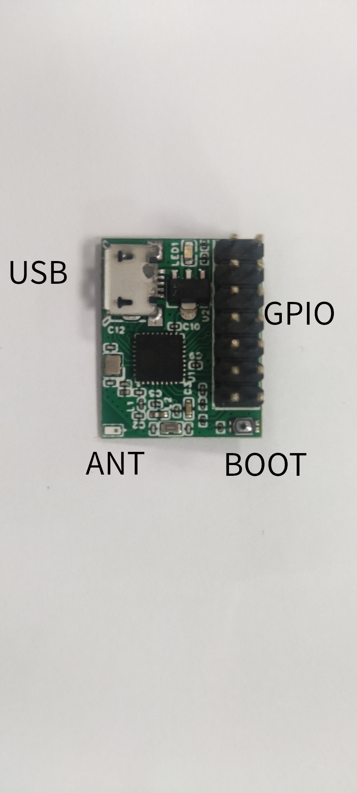
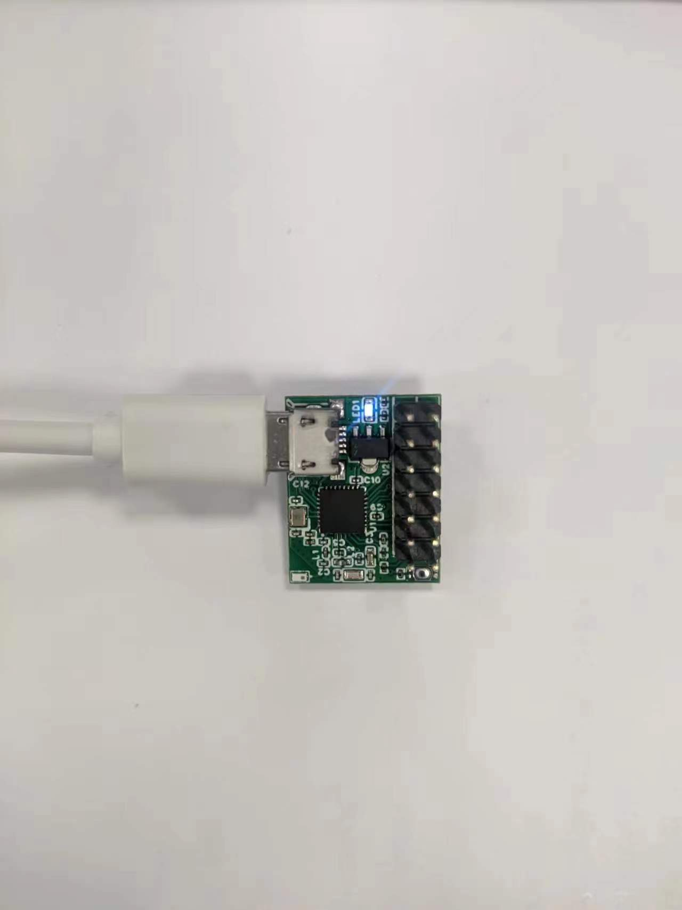

# ESP32C3-Core

基于ESP32-C3的最小系统板，带USB/JTAG/RTC/天线，IO引出

<iframe src="//player.bilibili.com/player.html?bvid=BV1sA411z7gd&page=1" scrolling="no" border="0" frameborder="no" framespacing="0" allowfullscreen="true" width="600" height="400"> </iframe>

<figure class="third">

</figure>
