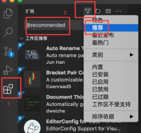

# 开发环境

## 操作系统

推荐使用[Ubuntu](https://ubuntu.com)开发，理论支持Debian系的所有发行版。

## 配置要求

最少1G内存，20G存储空间

## IDE

推荐使用[VS Code](https://code.visualstudio.com/)进行开发，工程中已经包含配置文件，开箱即用。需要安装必备插件`C/C++`  `CMake`。

## 编译工具链

### arm-none-eabi-gcc

Ubuntu默认apt仓库的arm工具链为不带gdb的旧版，但是能够正常编译

    sudo apt install gcc-arm-none-eabi

建议到[arm官网](https://developer.arm.com/downloads/-/arm-gnu-toolchain-downloads)下载新版编译器解压到`/opt`文件夹下，并将`/opt/arm-gun-toolchain-xx.x/bin`下的所有文件链接到`/usr/bin`，CMake会自动查找此目录下的编译器。

链接命令：

    sudo ln -s /opt/arm-gun-toolchain-xx.x/bin/* /usr/bin

### Clang

clangd最低版本要求为clangd-12，低于此版本会导致VSCode的自动补全失效。部分发行版仓库中默认为clangd-10，这种情况请将命令中的`clangd`替换为`clangd-12`或者更高版本

    sudo apt install clang clangd

## 构建工具

### CMake && Ninja

    sudo apt install cmake ninja-build python3-tk

## VSCode插件

使用VSCode打开工程后，在插件中筛选推荐，然后安装所有工作区推荐插件

## 仿真平台

基于[Webots](https://www.cyberbotics.com/),需要使用deb方式安装
