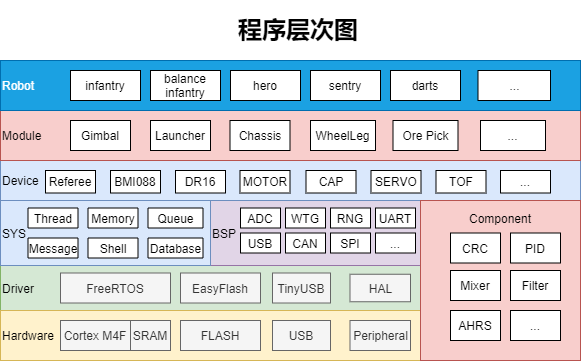

# 适配一块新的开发板

请确保你熟悉CMake，Kconfig与所使用的编译器，否则你极有可能遇到难以解决的问题。

## 我们要做什么

这是以大疆C型开发板作为参考的程序架构图，Hardware层为开发板硬件。我们要先编写驱动，以便在开发板上运行操作系统，操作硬件外设，即为Driver层。最后为不同操作系统和外设提供统一的接口供上层代码调用，即BSP和SYS层。

## 使用CMake组织开发板工程

确保你能够使用CMake编译出开发板的完整固件，我们将会使用此工程移植为XRobot的一个完整BSP。
如果开发板主控为STM32，可参考其他STM32开发板的BSP通过STM32CUBEMX生成。

## 选择编译器

如果你的开发板所使用的编译器并不能在toolchain文件夹中找到同名cmake文件，请参考`toolchain/arm-none-eabi.cmake`，为你的开发板创建一个新的cmake文件，并在其中进行编译器设置。

## 在hw/bsp创建新的BSP文件夹

一个完整的BSP应当包含以下文件，其中不应当包含main函数，只在bsp_init()函数中完成所有初始化动作，并在bsp_xx.c中实现对应外设的操作接口。

    .
    ├── board.cmake
    ├── config
    ├── debug
    │   └── launch.json
    ├── drivers
    │   ├── bsp_xx.c
    │   ├── bsp_xx.h
    │   ├── bsp.c
    │   ├── bsp.h
    │   └── CMakeLists.txt
    ├── Kconfig
    ├── toolchain.cmake
    └── main.cpp

### board.cmake

    # 需要与文件夹同名
    set(BOARD_NAME your_board_name)

    # 定义后面可能需要的路径名
    set(BOARD_DIR ${BSP_DIR}/${BOARD_NAME})

    # 包含所需要的.cmake脚本
    include(${MCU_DIR}/xx/cmake/xx.cmake)

    # 加入driver下所有CMake项目
    add_subdirectory(${BOARD_DIR}/drivers)

    # 添加可执行文件
    add_executable(${PROJECT_NAME}.elf ${BOARD_DIR}/main.cpp)

    # 添加链接库
    target_link_libraries(
        ${PROJECT_NAME}.elf
        PUBLIC bsp
        PUBLIC system
        PUBLIC robot
    )

    # 添加头文件路径
    target_include_directories(
        ${PROJECT_NAME}.elf
        PUBLIC ${CMAKE_CURRENT_SOURCE_DIR}
        PRIVATE $<TARGET_PROPERTY:bsp,INTERFACE_INCLUDE_DIRECTORIES>
        PRIVATE $<TARGET_PROPERTY:system,INTERFACE_INCLUDE_DIRECTORIES>
        PRIVATE $<TARGET_PROPERTY:robot,INTERFACE_INCLUDE_DIRECTORIES>
    )

### toolchain.cmake

    # 完成对编译器的配置
    set(CMAKE_C_COMPILER clang)
    set(CMAKE_CXX_COMPILER clang++)
    set(CMAKE_ASM_COMPILER clang)

### Kconfig

开发板的参数和功能配置，没有内容需要放置空文件。任何Kconfig的选项被选择之后，都会以cmake变量和宏定义的形式加入到编译过程去，在工程的每一处都能够使用。

### driver

bsp.c和bsp.h里需要定义bsp_init()函数，其他外设参考hw/bsp/rm-c/drivers编写。只要求头文件的函数声明和枚举格式相同，不关心函数的具体实现，实现对应功能即可。

### debug

launch.json为VSCode调试的配置文件，编译时会自动拷贝到.vscode目录下。

### main.cpp

分别执行对bsp,robot和system进行初始化。因为某些厂商提供的sdk中已经包含了main函数（比如ESP-IDF），所以每一个BSP都要自行提供main函数来初始化XRobot。

    #include "bsp.h"
    #include "robot.hpp"
    #include "thread.hpp"

    int main() {
        bsp_init();
        robot_init();
        System::Thread::StartKernel();
    }

## 选择此开发板

如果配置合理，在命令行输入`./project.py config`即可选择刚刚创建的开发板。
