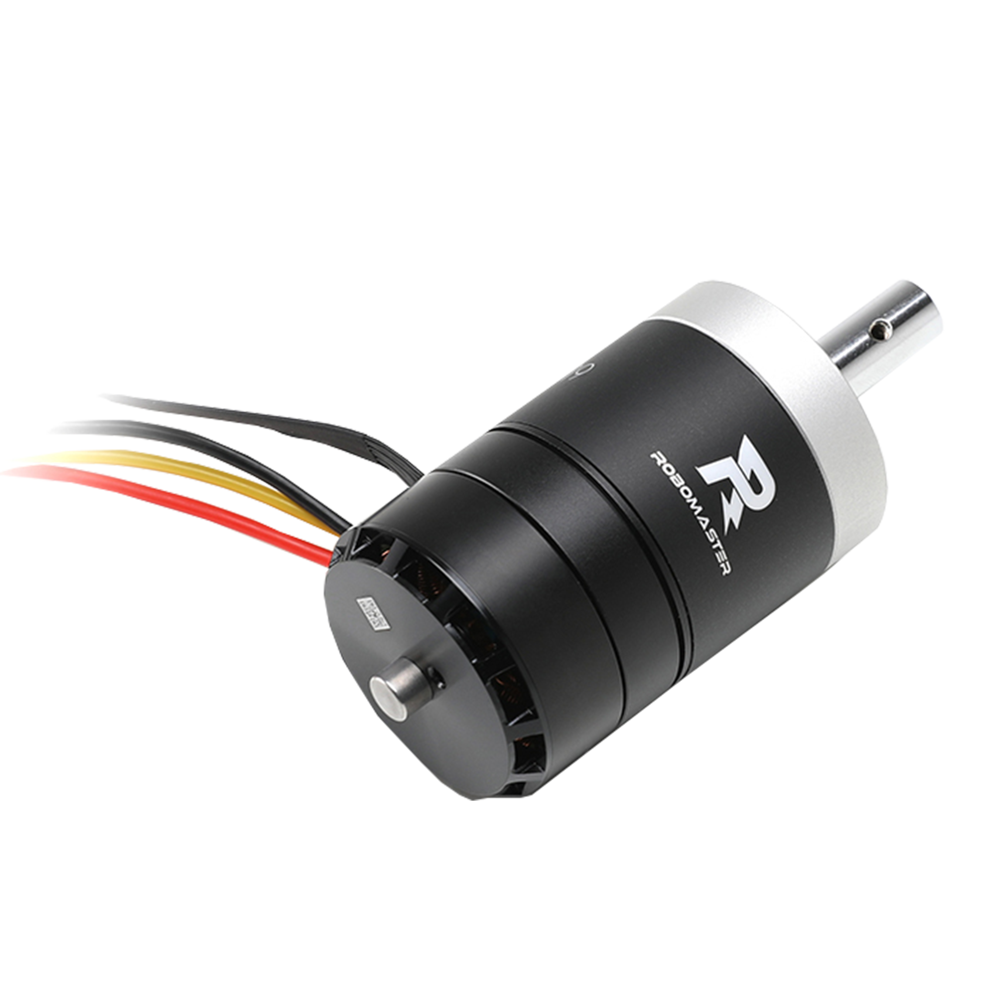

# 控制一个真实的电机

在现实中使用上一节编写的speed_control控制3508电机

## 创建新的机器人

使用`./project.py new robot motor_ctrl`来创建。

    motor_ctrl
    ├── Kconfig
    ├── robot.cpp
    └── robot.hpp

 `robot.hpp`

## 包含头文件

    #include "dev_blink_led.hpp"
    #include "mod_speed_control.hpp"

## 声明机器人类

    namespace Robot {
    class MotorCtrl {
      ...
    };
    }  // namespace Robot

### 声明配置文件结构体

    typedef struct {    #include <system.hpp>

    Device::BlinkLED led_;      /* led设备 */
    Device::Can can_;           /* CAN设备 */

    Module::SpeedControl speed_control_; /* 速度控制模块 */

### 头文件和命名空间

 `robot.cpp`

    #include "robot.hpp"

    #include <system.hpp>

    using namespace Robot;

### 编写配置文件

    /* clang-format off */
    Robot:: MotorCtrl:: Param param = {
        /* LED引脚和闪烁延时 */
        .led = {
        .gpio = BSP_GPIO_LED,
        .timeout = 200,
        },

        .speed_ctrl = {
        /* PID参数 out=k*(p+i+d) */
        .pid = {
            .k = 0.5f,
            .p = 1.0f,
            .i = 0.0f,
            .d = 0.0f,
            .i_limit = 1.0f,
            .out_limit = 1.0f,
            .d_cutoff_freq = -1.0f,
            .range = -1.0f,
        },

        /* 电机参数 型号和ID等 */
        .motor = {
            .id_feedback = 0x201,
            .id_control = M3508_M2006_CTRL_ID_BASE,
            .model = Device::RMMotor::MOTOR_M3508,
            .can = BSP_CAN_1,
        }
        }
    };
    /* clang-format on */

## 编写robot_init()函数

    void robot_init() {
      auto init_thread_fn =  {
        RM_UNUSED(arg);

        System::Init();

        Robot::MotorCtrl motor_ctrl(param);

        while (1) {
          System::Thread::Sleep(UINT32_MAX);
        }
      };

      System::Thread init_thread;

      init_thread.Create(init_thread_fn, (void*)0, "init_thread_fn", 512,
                        System::Thread::REALTIME);
    }

## 编译运行

### Kconfig选择所需开发板和模块

在终端中输入 `./project.py config`

选择board-rm-c（即c板），操作系统选择FreeRTOS, 机器人选择motor_ctrl，设备选择can、motor、blink_led，模块选择刚刚创建的speed_control.

### 编译下载代码

点击下方Build编译成功之后使用Ozone或者OpenOCD下载固件

### 调试运行

连接电源与电机，设置电机目标速度，测试运行是否正常。

## 注意

* C板can模块需要5V以上供电
* `/* clang-format off */`和`/* clang-format on */`是防止中间内容被格式化，方便阅读。

## 完整代码示例

 `robot.cpp`

    #include "robot.hpp"

    #include <system.hpp>

    using namespace Robot;

    /* clang-format off */
    Robot:: MotorCtrl:: Param param = {
        /* LED引脚和闪烁延时 */
        .led = {
        .gpio = BSP_GPIO_LED,
        .timeout = 200,
        },

        .speed_ctrl = {
        /* PID参数 out=k*(p+i+d) */
        .pid = {
            .k = 0.5f,
            .p = 1.0f,
            .i = 0.0f,
            .d = 0.0f,
            .i_limit = 1.0f,
            .out_limit = 1.0f,
            .d_cutoff_freq = -1.0f,
            .range = -1.0f,
        },

        /* 电机参数 型号和ID等 */
        .motor = {
            .id_feedback = 0x201,
            .id_control = M3508_M2006_CTRL_ID_BASE,
            .model = Device::RMMotor::MOTOR_M3508,
            .can = BSP_CAN_1,
        }
        }
    };
    /* clang-format on */

    void robot_init() {
      auto init_thread_fn =  {
        RM_UNUSED(arg);

        System::Init();

        Robot::MotorCtrl motor_ctrl(param);

        while (1) {
          System::Thread::Sleep(UINT32_MAX);
        }
      };

      System::Thread init_thread;

      init_thread.Create(init_thread_fn, (void*)0, "init_thread_fn", 512,
                        System::Thread::REALTIME);
    }

 `robot.hpp`

    #include "dev_blink_led.hpp"
    #include "mod_speed_control.hpp"

    void robot_init();

    namespace Robot {
    class MotorCtrl {
    public:
      typedef struct {
        Device::BlinkLED::Param led;
        Module::SpeedControl::Param speed_ctrl;
      } Param;

      MotorCtrl(Param& param) : led_(param.led), speed_control_(param.speed_ctrl) {}

      Device::BlinkLED led_;      /* led设备 */
      Device::Can can_;           /* CAN设备 */

      Module::SpeedControl speed_control_; /* 速度控制模块 */
    };
    }  // namespace Robot
