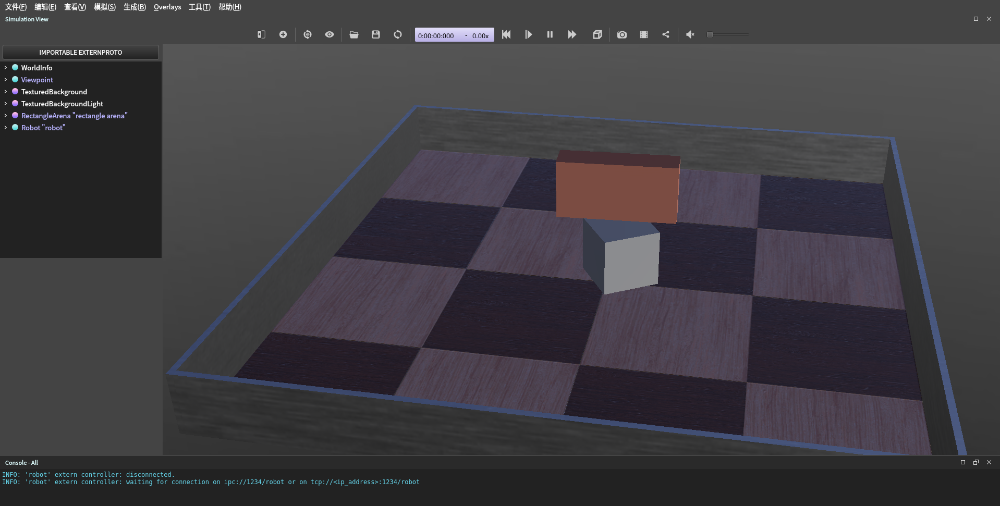

# 在模拟器中控制电机

在webots中模拟一个电机，并使用speed_control进行控制

## 模拟器中创建电机

使用webots创建一个关节节点，添加电机和位置传感器。电机的名称需要和代码中构造电机类时传入的字符串相同，传感器名称为电机名+`_Sensor`。比如本次使用的电机为`motor`，传感器为`motor_Sensor`。

最下方提供了一个示例的模拟器世界。

## 创建新的机器人

使用`./project.py new robot motor_ctrl`来创建。

    motor_ctrl
    ├── Kconfig
    ├── robot.cpp
    └── robot.hpp

 `robot.hpp`

## 包含头文件

    #include "dev_blink_led.hpp"
    #include "mod_speed_control.hpp"
    #include "system.hpp"

## 声明机器人类

    namespace Robot {
    class MotorCtrl {
      ...
    };
    }  // namespace Robot

### 声明配置文件结构体

    typedef struct {
      Device::BlinkLED::Param led;
      Module::SpeedControl::Param speed_ctrl;
    } Param;

### 声明构造函数

    MotorCtrl(Param& param) : led_(param.led), speed_control_(param.speed_ctrl) {}

### 其他变量

    Device::BlinkLED led_;      /* led设备 */

    Module::SpeedControl speed_control_; /* 速度控制模块 */

### 头文件和命名空间

 `robot.cpp`

    #include "robot.hpp"

    using namespace Robot;

### 编写配置文件

    /* clang-format off */
    Robot:: MotorCtrl:: Param param = {
        /* LED引脚和闪烁延时 */
        .led = {
        .gpio = BSP_GPIO_LED,
        .timeout = 200,
        },

        .speed_ctrl = {
        /* PID参数 out=k*(p+i+d) */
        .pid = {
            .k = 0.5f,
            .p = 1.0f,
            .i = 0.0f,
            .d = 0.0f,
            .i_limit = 1.0f,
            .out_limit = 1.0f,
            .d_cutoff_freq = -1.0f,
            .range = -1.0f,
        },

        /* 电机型号 */
        .motor = {
            .model = Device::RMMotor::MOTOR_M3508,
        }
        }
    };
    /* clang-format on */

## 编写robot_init()函数

    void robot_init() {
      auto init_thread_fn =  {
        RM_UNUSED(arg);

        System::Init();

        Robot::MotorCtrl motor_ctrl(param);

        while (1) {
          System::Thread::Sleep(UINT32_MAX);
        }
      };

      System::Thread init_thread;

      init_thread.Create(init_thread_fn, (void*)0, "init_thread_fn", 512,
                        System::Thread::Realtime);
    }

## 编译运行

### Kconfig选择所需开发板和模块

在终端中输入 `./project.py config`

选择board-Webots（即c板），操作系统选择Linux-Webots, 机器人选择motor_ctrl，设备选择simulator、blink_led，模块选择刚刚创建的speed_control.

### 编译下载代码

点击下方Build编译成功之后可以直接运行。

### 调试运行

Webots控制器选择`<extern>`，开始仿真。代码运行后仿真会自动启动。

## 注意

* 仿真停止后代码也会停止运行
* `/* clang-format off */`和`/* clang-format on */`是防止中间内容被格式化，方便阅读。

## 完整代码示例

`robot.cpp`

    #include "robot.hpp"

    #include "system.hpp"

    using namespace Robot;

    /* clang-format off */
    Robot:: MotorCtrl:: Param param = {
        /* LED引脚和闪烁延时 */
        .led = {
        .gpio = BSP_GPIO_LED,
        .timeout = 200,
        },

        .speed_ctrl = {
        /* PID参数 out=k*(p+i+d) */
        .pid = {
            .k = 0.5f,
            .p = 1.0f,
            .i = 0.0f,
            .d = 0.0f,
            .i_limit = 1.0f,
            .out_limit = 1.0f,
            .d_cutoff_freq = -1.0f,
            .range = -1.0f,
        },

        /* 电机型号 */
        .motor = {
            .model = Device::RMMotor::MOTOR_M3508,
        }
        }
    };
    /* clang-format on */

    void robot_init() {
      auto init_thread_fn =  {
        RM_UNUSED(arg);

        System::Init();

        Robot::MotorCtrl motor_ctrl(param);

        while (1) {
          System::Thread::Sleep(UINT32_MAX);
        }
      };

      System::Thread init_thread;

      init_thread.Create(init_thread_fn, (void*)0, "init_thread_fn", 512,
                        System::Thread::Realtime);
    }

`robot.hpp`

    #include "dev_blink_led.hpp"
    #include "mod_speed_control.hpp"

    void robot_init();

    namespace Robot {
    class MotorCtrl {
    public:
      typedef struct {
        Device::BlinkLED::Param led;
        Module::SpeedControl::Param speed_ctrl;
      } Param;

      MotorCtrl(Param& param) : led_(param.led), speed_control_(param.speed_ctrl) {}

      Device::BlinkLED led_;      /* led设备 */

      Module::SpeedControl speed_control_; /* 速度控制模块 */
    };
    }  // namespace Robot

## 示例模拟器世界

复制到新建文本文件后重命名后缀为.wbt，用webots打开即可。

    #VRML_SIM R2023a utf8

    EXTERNPROTO "https://raw.githubusercontent.com/cyberbotics/webots/R2023a/projects/objects/backgrounds/protos/TexturedBackground.proto"
    EXTERNPROTO "https://raw.githubusercontent.com/cyberbotics/webots/R2023a/projects/objects/backgrounds/protos/TexturedBackgroundLight.proto"
    EXTERNPROTO "https://raw.githubusercontent.com/cyberbotics/webots/R2023a/projects/objects/floors/protos/RectangleArena.proto"

    WorldInfo {
    }
    Viewpoint {
      orientation -0.2525745875314762 0.02130501307348454 0.9673428420943856 2.9787711980282734
      position 2.428173135645626 -0.425251174588113 1.8754544030631721
    }
    TexturedBackground {
    }
    TexturedBackgroundLight {
    }
    RectangleArena {
      translation 0 0 0.06
      rotation 0 1 0 0
    }
    Robot {
      translation -0.026194340058477504 0.019437510727062075 0.10959582795187232
      rotation -2.3408499198804226e-06 8.355531741370088e-05 0.9999999965065146 0.553088838487368
      children [
        LED {
        }
        HingeJoint {
          jointParameters HingeJointParameters {
            position 112.59455088327728
            axis 0 0 1
          }
          device [
            RotationalMotor {
              name "motor"
            }
            PositionSensor {
              name "motor_Sensor"
            }
          ]
          endPoint Solid {
            translation 0.003223968509582818 -0.008062181310537507 0.12409210293181766
            rotation 0 0 -1 0.5027846459552783
            children [
              DEF body Shape {
                appearance PBRAppearance {
                  baseColor 1 0.6 0.5
                  roughness 1
                }
                geometry Box {
                  size 0.05 0.2 0.1
                }
              }
            ]
            boundingObject USE body
            physics Physics {
              density 30
            }
            linearVelocity -0.02491776446448625 0.023763738767246807 -2.7009730748132074e-10
            angularVelocity -1.9427271284808768e-07 -1.4104240025064485e-07 3.857348460788068
          }
        }
        DEF body Shape {
          appearance PBRAppearance {
            roughness 1
          }
          geometry Box {
            size 0.1 0.1 0.1
          }
        }
      ]
      boundingObject USE body
      physics Physics {
      }
      controller "<extern>"
      linearVelocity -2.1119925780472765e-06 8.545258980133542e-06 3.0206592782633374e-13
      angularVelocity -0.00017078287405238133 -4.2388723943527556e-05 6.0174078470845345e-09
    }