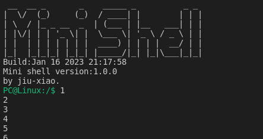

# 订阅消息

在创建topic之后，再开启一个线程用于获取topic上的数据。

## 开启新的线程

加入sub_thread

    System::Thread pub_thread_, sub_thread_;

创建

```cpp
auto sub_thread_fn = [](MessageTest* msg_test) {
  while (1) {
    msg_test->pub_thread_.SleepUntil(1);
  }
};
this->pub_thread_.Create(sub_thread_fn, this, "msg_test_sub_thread", 256,
                           System::Thread::MEDIUM);
```

## 订阅话题

订阅话题时需要等待话题创建完成，此处如果先订阅再创建话题，就会产生死锁。所以应该把话题的创建放在构造函数里，订阅话题应当在线程运行之后。

使用话题名订阅话题，订阅时需要指定消息的存放位置

```cpp
auto tp_sub = Message::Subscriber<Data>("test_topic", msg_test->pub_data_);
```

或者使用话题对象来订阅

```cpp
auto tp_sub = Message::Subscriber<Data>(msg_test->topic_, msg_test->pub_data_);
```

最后从话题中得到数据

```cpp
tp_sub.DumpData();
```

## 示例

因为代码现在运行在linux上，在`tp_sub.DumpData()`的后面加入`printf("%d\n", msg_test->pub_data_.d2)`，可以直接在命令行查看运行的结果



`mod_message_test.cpp`

```cpp
#include "mod_message_test.hpp"

#include <thread.hpp>

using namespace Module;

MessageTest::MessageTest(Param& param) : param_(param), topic_("test_topic") {
  auto pub_thread_fn = [](MessageTest* msg_test) {
    while (1) {
      msg_test->pub_data_.d2++;
      msg_test->topic_.Publish(msg_test->pub_data_);
      msg_test->pub_thread_.SleepUntil(1);
    }
  };
  this->pub_thread_.Create(pub_thread_fn, this, "msg_test_pub_thread", 256,
                           System::Thread::MEDIUM);

  auto sub_thread_fn = [](MessageTest* msg_test) {
    auto tp_sub = Message::Subscriber<Data>("test_topic", msg_test->pub_data_);
    while (1) {
      tp_sub.DumpData();
      msg_test->pub_thread_.SleepUntil(1);
    }
  };
  this->pub_thread_.Create(sub_thread_fn, this, "msg_test_sub_thread", 256,
                           System::Thread::MEDIUM);
}
```

`mod_message_test.hpp`

```cpp
#include <module.hpp>
#include <thread.hpp>

#include "om.hpp"

namespace Module {
class MessageTest {
 public:
  struct Param {};

  struct Data {
    float d1;
    int d2;
    char d3;
  };

  MessageTest(Param& param);

  Param& param_;

  Data pub_data_;

  Data sub_data_;

  Message::Topic<Data> topic_;

  System::Thread pub_thread_, sub_thread_;
};
}  // namespace Module
```
