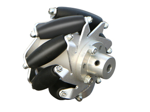

# 设计麦轮底盘

利用前面的知识，从头开始设计麦克纳姆轮底盘。

## 创建麦轮模块

使用下面命令创建一个mecanum模块

```shell
./project.py new module mecanum
```

然后完善mod_mecanum.cpp和mod_mecanum.hpp文件。开启一个线程用来控制，再定义一个Param结构体用来存放pid等参数

`mod_mecanum.cpp`

```c++
#include "mod_mecanum.hpp"

using namespace Module;

Mecanum::Mecanum(Param& param) : param_(param) {
  auto thread_fn = [](Mecanum* mecanum) {
    while (true) {
      mecanum->thread_.SleepUntil(2);
    }
  };

  this->thread_.Create(thread_fn, this, "mecanum_ctrl", 512,
                       System::Thread::MEDIUM);
}
```

`mod_mecanum.hpp`

```c++
#include "module.hpp"

namespace Module {
class Mecanum {
 public:
  struct Param {};

  Mecanum(Param& param);

 private:
  Param& param_;

  System::Thread thread_;
};
}  // namespace Module

```

## 麦轮控制原理



完整的麦轮底盘需要四个麦克纳姆轮，以O型的方式安装。在小轮的作用下，每个轮子对底盘的力的作用方向和轮子的转动方向呈45度角。

这里轮子顺序按照图中编号，箭头所指y轴正方向为车的正前方，车身顺时针旋转为z轴。

```txt
   ②   y轴正方向    ①
  ///      ↑       \\\
  ///-|    ↑     |-\\\
  /// |    ↑     | \\\
      |          |
      |----------|   ---------> x轴正方向
      |          |
  \\\ |          | ///
  \\\-|          |-///
  \\\              ///
   ③               ④
```

如果运动向量为xyz，那么每个轮子的目标速度应当为

```c++
speed_1 = x - y + z;
speed_2 = x + y + z;
speed_3 = -x + y + z;
speed_4 = -x - y + z;
```

## 底盘模式

```c++
typedef enum {
    RELAX,         /* 放松模式，电机不输出。一般情况底盘初始化之后的模式 */
    FOLLOW_GIMBAL, /* 通过闭环控制使车头方向跟随云台 */
    ROTOR,         /* 小陀螺模式，通过闭环控制使底盘不停旋转 */
    INDENPENDENT,  /* 独立模式。底盘运行不受云台影响 */
} Mode;
```

还有这些模式对应的事件

```c++
typedef enum {
    SET_MODE_RELAX,
    SET_MODE_FOLLOW_GIMBAL,
    SET_MODE_ROTOR,
    SET_MODE_INDENPENDENT
} Event;
```

## 电机

为了能使麦轮模块适配多种电机，此处选择在构造时传入BaseMotor指针，不考虑具体电机型号。因为其他电机都由BaseMotor类派生出来。

[使用std::array而不是数组的原因](../../4.develop/1.code_style.md)

```c++
namespace Module {
class Mecanum {
 public:
  ...
  Mecanum(Param& param, std::array<Device::BaseMotor*, 4> motor);
  ...

 private:
  ...
  std::array<Device::BaseMotor*, 4> motor_;
  ...
};
}  // namespace Module
```

## 执行器

在comp_actuator.hpp内，定义了Component::SpeedActuator和Component::PosActuator两种执行器。

`Component::SpeedActuator`

```txt
速度反馈->低通滤波器->速度PID环->输出->低通滤波器->返回
```

`Component::PosActuator`

```txt
                       角速度反馈
                           ↓
                       低通滤波器
                       ↓      ↓
角度反馈->低通滤波器->角度PID环->速度PID环->输出->低通滤波器->返回
```

此处我们选择直接使用四个SpeedActuator来控制电机，并添加配置文件

```c++
namespace Module {
class Mecanum {
 public:
  struct Param {
    std::array<Component::SpeedActuator::Param, 4> speed_actr;
    ...
  };
  ...

 private:
  Param& param_;

  ...
  std::array<Component::SpeedActuator*, 4> speed_actr_;
  ...
};
}  // namespace Module
```

然后在构造函数里进行初始化。在构造函数中尽量使用`.at(N)`访问std::array而不是通过下标访问，以便启用越界检查，同时又不至于损失运行时性能。

```c++
for (int i = 0; i < 4; i++) {
  speed_actr_.at(i) =
      new Component::SpeedActuator(param.speed_actr.at(i), 500.0f);
}
```

同时还需要一个pid控制器来跟随云台

```c++
Component::PID follow_pid_; /* 跟随云台用的PID */
```

到了这里，这个类基本定义完成

`mod_mecanum.cpp`

```c++
#include "mod_mecanum.hpp"

#include <comp_actuator.hpp>
#include <memory.hpp>

using namespace Module;

Mecanum::Mecanum(Param& param, std::array<Device::BaseMotor*, 4> motor)
    : param_(param),
      mode_(RELAX),
      motor_(motor),
      follow_pid_(param.follow, 500.0f){
  for (int i = 0; i < 4; i++) {
    speed_actr_.at(i) =
        new Component::SpeedActuator(param.speed_actr.at(i), 500.0f);
  }

  auto thread_fn = [](Mecanum* mecanum) {
    while (true) {
      mecanum->thread_.SleepUntil(2);
    }
  };

  this->thread_.Create(thread_fn, this, "mecanum_ctrl", 512,
                       System::Thread::MEDIUM);
}
```

`mod_mecanum.hpp`

```c++
#include <array>
#include <comp_cmd.hpp>

#include "comp_actuator.hpp"
#include "dev_motor.hpp"
#include "module.hpp"

namespace Module {
class Mecanum {
 public:
  struct Param {
    std::array<Component::SpeedActuator::Param, 4> speed_actr;
    Component::PID::Param follow;
  };

  typedef enum {
    RELAX, /* 放松模式，电机不输出。一般情况底盘初始化之后的模式 */
    FOLLOW_GIMBAL, /* 通过闭环控制使车头方向跟随云台 */
    ROTOR, /* 小陀螺模式，通过闭环控制使底盘不停旋转 */
    INDENPENDENT, /* 独立模式。底盘运行不受云台影响 */
  } Mode;

  typedef enum {
    SET_MODE_RELAX,
    SET_MODE_FOLLOW_GIMBAL,
    SET_MODE_ROTOR,
    SET_MODE_INDENPENDENT
  } Event;

  Mecanum(Param& param, std::array<Device::BaseMotor*, 4> motor);

 private:
  Param& param_;

  Mode mode_;

  float yaw_;

  Component::CMD::ChassisCMD cmd_;

  std::array<Device::BaseMotor, 4>& motor_;

  std::array<Component::SpeedActuator*, 4> speed_actr_;

  Component::PID follow_pid_; /* 跟随云台用的PID */

  System::Thread thread_;
};
}  // namespace Module
```

## 接收控制命令

在线程的循环开始之前订阅`cmd_chassis`和`chassis_yaw`这两个topic。一个为控制器发来的底盘控制命令，另一个为云台发送的与底盘的角度之差。

由于可能有机器人不存在云台的情况，所以将chassis_yaw的订阅延时设置为30ms。超过30ms未订阅到这个话题就会选择跳过。忽略第三个参数将会永久等待。

```c++
auto yaw_sub = Message::Subscriber("chassis_yaw", chassis->yaw_, 30);
auto cmd_sub = Message::Subscriber("cmd_chassis", chassis->cmd_);
```

然后在循环中定时获取消息

```c++
yaw_sub.DumpData();
cmd_sub.DumpData();
```

然后在构造函数中添加对事件的处理。由于Mode和Event枚举值是一一对应的，我们直接将收到的event类型转换成Mode，然后传给SetMode。最后将this指针和event_map与回调函数注册给CMD，等待调用。

```c++
auto event_callback = [](Event event, Mecanum* mecanum) {
  mecanum->SetMode(static_cast<Mode>(event));
};

Component::CMD::RegisterEvent<Mecanum*, Event>(event_callback, this,
                                                this->param_.EVENT_MAP);
```

## 声明函数

在hpp中声明以下函数

```c++
/* 更新电机反馈 */
void UpdateFeedback();

/* 计算输出 */
void Control();

/* 电机输出 */
void SendOutput();

/* 更改模式 */
void SetMode(Mode mode);
```

更新控制线程流程

```c++
auto thread_fn = [](Mecanum* mecanum) {
  auto yaw_sub = Message::Subscriber("chassis_yaw", mecanum->yaw_, 30);
  auto cmd_sub = Message::Subscriber("cmd_chassis", mecanum->cmd_);

  while (true) {
    yaw_sub.DumpData();
    cmd_sub.DumpData();

    mecanum->UpdateFeedback();

    mecanum->Control();

    mecanum->SendOutput();

    mecanum->thread_.SleepUntil(2);
  }
};
```

## 控制加锁

类内创建一个长度为1的信号量，在执行Control函数和SetMode函数前后分别Take和Give一次，保证控制流程不被回调函数打断。

```c++
mecanum->UpdateFeedback();

mecanum->ctrl_lock_.Take(UINT32_MAX);

mecanum->Control();

mecanum->ctrl_lock_.Give();

mecanum->SendOutput();
```

```c++
auto event_callback = [](uint32_t event, void* arg) {
  Mecanum* mecanum = static_cast<Mecanum*>(arg);

  mecanum->ctrl_lock_.Take(UINT32_MAX);

  mecanum->SetMode(static_cast<Mode>(event));

  mecanum->ctrl_lock_.Give();
};
```

## 更新电机反馈

```c++
void Mecanum::UpdateFeedback() {
  for (Device::BaseMotor* motor : this->motor_) {
    motor->Update();
  }
}
```

## 更改模式

新建一个float变量rotor_dir_来记录小陀螺旋转方向。

```c++
void Mecanum::SetMode(Mode mode) {
  if (mode == this->mode_) {
    return; /* 模式未改变直接返回 */
  }

  if (mode == ROTOR) {
    /* 随机小陀螺方向 */
    this->rotor_dir_ = bsp_time_get_ms() % 2 ? 1.0f : -1.0f;
  }

  for (Component::SpeedActuator* actr : this->speed_actr_) {
    actr->Reset();
  }

  this->mode_ = mode;
}
```

## 控制

`void Mecanum::Control()`

添加以下宏

```c++
/* ROTOR SPEED = C + A * (OMEGA * t) */
#define ROTOR_C 0.4f                       /* 小陀螺速度向量常量 */
#define ROTOR_A 0.2f                       /* 小陀螺速度向量系数 */
#define ROTOR_OMEGA M_PI_2                 /* 小陀螺速度角速度 */
#define MOTOR_MAX_ROTATIONAL_SPEED 7000.0f /* 电机的最大转速 */
```

新建三个float变量now_,dt_和last_wakeup_来记录唤醒时间，再新建`Component::Type::MoveVector move_vec_`来存放运动向量。

```c++
/* 更新时间 */
this->now_ = bsp_time_get();
this->dt_ = this->now_ - this->last_wakeup_;
this->last_wakeup_ = this->now_;
```

根据模式不同将控制命令转化为控制向量

```c++
/* 更新控制向量 */
switch (this->mode_) {
  case RELAX: /* 清空所有控制向量 */
    memset(&this->move_vec_, 0, sizeof(this->move_vec_));
    break;
  case FOLLOW_GIMBAL: /* 向云台方向运动 */ {
    this->move_vec_.wz =
        this->follow_pid_.Calculate(0.0f, this->yaw_, this->dt_);
    float cos_beta = cosf(this->yaw_);
    float sin_beta = sinf(this->yaw_);
    this->move_vec_.vx = cos_beta * this->cmd_.x - sin_beta * this->cmd_.y;
    this->move_vec_.vy = sin_beta * this->cmd_.x + cos_beta * this->cmd_.y;
    break;
  }
  case ROTOR: /* 计算目标小陀螺速度 */ {
    this->move_vec_.wz =
        fabsf(ROTOR_C + ROTOR_A * sinf(ROTOR_OMEGA * this->now_));
    float cos_beta = cosf(this->yaw_);
    float sin_beta = sinf(this->yaw_);
    this->move_vec_.vx = cos_beta * this->cmd_.x - sin_beta * this->cmd_.y;
    this->move_vec_.vy = sin_beta * this->cmd_.x + cos_beta * this->cmd_.y;
    break;
  }
  case INDENPENDENT: /* 独立运动 */
    this->move_vec_.wz = this->cmd_.z;
    this->move_vec_.vx = this->cmd_.x;
    this->move_vec_.vy = this->cmd_.y;
    break;
  default:
    ASSERT(false);
}
```

创建两个float数组来存放目标速度和电机输出值

```c++
std::array<float, 4> speed_setpoint_;

std::array<float, 4> motor_output_;
```

然后根据公式计算每个电机的目标转速

```c++
speed_setpoint_[0] = move_vec_.vx - move_vec_.vy + move_vec_.wz;
speed_setpoint_[1] = move_vec_.vx + move_vec_.vy + move_vec_.wz;
speed_setpoint_[2] = -move_vec_.vx + move_vec_.vy + move_vec_.wz;
speed_setpoint_[3] = -move_vec_.vx - move_vec_.vy + move_vec_.wz;
```

通过PID计算电机目标输出。由于目标速度为-1.0到1.0，而电机的反馈速度为实际速度，所以需要乘以MOTOR_MAX_ROTATIONAL_SPEED。

```c++
switch (this->mode_) {
  case RELAX:
    memset(&motor_output_, 0, sizeof(motor_output_));
    break;
  case FOLLOW_GIMBAL:
  case ROTOR:
  case INDENPENDENT:
    for (int i = 0; i < 4; i++) {
      motor_output_[i] = speed_actr_[i]->Calculate(
          speed_setpoint_[i] * MOTOR_MAX_ROTATIONAL_SPEED,
          motor_[i]->GetSpeed(), dt_);
    }
}
```

## 发送电机控制命令

```c++
void Mecanum::SendOutput() {
  if (mode_ == RELAX) {
    for (auto motor : motor_) {
      motor->Relax();
    }
  } else {
    for (int i = 0; i < 4; i++) {
      motor_[i]->Control(motor_output_[i]);
    }
  }
}
```

## 完整代码示例

`mod_mecanum.cpp`

```c++
#include "mod_mecanum.hpp"

#include <comp_actuator.hpp>
#include <comp_utils.hpp>
#include "bsp_time.h"

/* ROTOR SPEED = C + A * (OMEGA * t) */
#define ROTOR_C 0.4f                       /* 小陀螺速度向量常量 */
#define ROTOR_A 0.2f                       /* 小陀螺速度向量系数 */
#define ROTOR_OMEGA M_PI_2                 /* 小陀螺速度角速度 */
#define MOTOR_MAX_ROTATIONAL_SPEED 7000.0f /* 电机的最大转速 */

using namespace Module;

Mecanum::Mecanum(Param& param, std::array<Device::BaseMotor*, 4> motor)
    : param_(param),
      mode_(RELAX),
      motor_(motor),
      follow_pid_(param.follow, 500.0f),
      ctrl_lock_(true) {
  for (int i = 0; i < 4; i++) {
    speed_actr_.at(i) =
        new Component::SpeedActuator(param.speed_actr.at(i), 500.0f);
  }

  auto thread_fn = [](Mecanum* mecanum) {
    auto yaw_sub = Message::Subscriber("chassis_yaw", mecanum->yaw_, 30);
    auto cmd_sub = Message::Subscriber("cmd_chassis", mecanum->cmd_);

    while (true) {
      yaw_sub.DumpData();
      cmd_sub.DumpData();

      mecanum->UpdateFeedback();

      mecanum->ctrl_lock_.Take(UINT32_MAX);

      mecanum->Control();

      mecanum->ctrl_lock_.Give();

      mecanum->SendOutput();

      mecanum->thread_.SleepUntil(2);
    }
  };

  this->thread_.Create(thread_fn, this, "mecanum_ctrl", 512,
                       System::Thread::MEDIUM);

  auto event_callback = [](Event event, Mecanum* mecanum) {
    mecanum->ctrl_lock_.Take(UINT32_MAX);

    mecanum->SetMode(static_cast<Mode>(event));

    mecanum->ctrl_lock_.Give();
  };

  Component::CMD::RegisterEvent<Mecanum*, Event>(event_callback, this,
                                                 this->param_.EVENT_MAP);
}

void Mecanum::UpdateFeedback() {
  for (Device::BaseMotor* motor : this->motor_) {
    motor->Update();
  }
}

void Mecanum::SetMode(Mode mode) {
  if (mode == this->mode_) {
    return; /* 模式未改变直接返回 */
  }

  if (mode == ROTOR) {
    /* 随机小陀螺方向 */
    this->rotor_dir_ = bsp_time_get_ms() % 2 ? 1.0f : -1.0f;
  }

  for (Component::SpeedActuator* actr : this->speed_actr_) {
    actr->Reset();
  }

  this->mode_ = mode;
}

void Mecanum::Control() {
  /* 更新时间 */
  this->now_ = bsp_time_get();
  this->dt_ = this->now_ - this->last_wakeup_;
  this->last_wakeup_ = this->now_;

  /* 更新控制向量 */
  switch (this->mode_) {
    case RELAX: /* 清空所有控制向量 */
      memset(&move_vec_, 0, sizeof(move_vec_));
      break;
    case FOLLOW_GIMBAL: /* 向云台方向运动 */ {
      move_vec_.wz = this->follow_pid_.Calculate(0.0f, this->yaw_, this->dt_);
      float cos_beta = cosf(this->yaw_);
      float sin_beta = sinf(this->yaw_);
      move_vec_.vx = cos_beta * this->cmd_.x - sin_beta * this->cmd_.y;
      move_vec_.vy = sin_beta * this->cmd_.x + cos_beta * this->cmd_.y;
      break;
    }
    case ROTOR: /* 计算目标小陀螺速度 */ {
      move_vec_.wz = fabsf(ROTOR_C + ROTOR_A * sinf(ROTOR_OMEGA * this->now_));
      float cos_beta = cosf(this->yaw_);
      float sin_beta = sinf(this->yaw_);
      move_vec_.vx = cos_beta * this->cmd_.x - sin_beta * this->cmd_.y;
      move_vec_.vy = sin_beta * this->cmd_.x + cos_beta * this->cmd_.y;
      break;
    }
    case INDENPENDENT: /* 独立运动 */
      move_vec_.wz = this->cmd_.z;
      move_vec_.vx = this->cmd_.x;
      move_vec_.vy = this->cmd_.y;
      break;
    default:
      ASSERT(false);
  }

  speed_setpoint_[0] = move_vec_.vx - move_vec_.vy + move_vec_.wz;
  speed_setpoint_[1] = move_vec_.vx + move_vec_.vy + move_vec_.wz;
  speed_setpoint_[2] = -move_vec_.vx + move_vec_.vy + move_vec_.wz;
  speed_setpoint_[3] = -move_vec_.vx - move_vec_.vy + move_vec_.wz;

  switch (this->mode_) {
    case RELAX:
      memset(&motor_output_, 0, sizeof(motor_output_));
      break;
    case FOLLOW_GIMBAL:
    case ROTOR:
    case INDENPENDENT:
      for (int i = 0; i < 4; i++) {
        motor_output_[i] = speed_actr_[i]->Calculate(
            speed_setpoint_[i] * MOTOR_MAX_ROTATIONAL_SPEED,
            motor_[i]->GetSpeed(), dt_);
      }
  }
}

void Mecanum::SendOutput() {
  if (mode_ == RELAX) {
    for (auto motor : motor_) {
      motor->Relax();
    }
  } else {
    for (int i = 0; i < 4; i++) {
      motor_[i]->Control(motor_output_[i]);
    }
  }
}
```

`mod_mecanum.hpp`

```c++
#include <comp_cmd.hpp>
#include <comp_pid.hpp>

#include "comp_actuator.hpp"
#include "dev_motor.hpp"
#include "module.hpp"

namespace Module {
class Mecanum {
 public:
  struct Param {
    const std::vector<Component::CMD::EventMapItem> EVENT_MAP;
    std::array<Component::SpeedActuator::Param, 4> speed_actr;
    Component::PID::Param follow;
  };

  typedef enum {
    RELAX, /* 放松模式，电机不输出。一般情况底盘初始化之后的模式 */
    FOLLOW_GIMBAL, /* 通过闭环控制使车头方向跟随云台 */
    ROTOR, /* 小陀螺模式，通过闭环控制使底盘不停旋转 */
    INDENPENDENT, /* 独立模式。底盘运行不受云台影响 */
  } Mode;

  typedef enum {
    SET_MODE_RELAX,
    SET_MODE_FOLLOW_GIMBAL,
    SET_MODE_ROTOR,
    SET_MODE_INDENPENDENT
  } Event;

  Mecanum(Param& param, std::array<Device::BaseMotor*, 4> motor);

  void UpdateFeedback();

  void Control();

  void SendOutput();

  void SetMode(Mode mode);

 private:
  float now_;
  float dt_;
  float last_wakeup_;

  Param& param_;

  Mode mode_;

  float yaw_;

  float rotor_dir_ = 1.0f;

  std::array<float, 4> speed_setpoint_;

  std::array<float, 4> motor_output_;

  Component::CMD::ChassisCMD cmd_;

  Component::Type::MoveVector move_vec_;

  std::array<Device::BaseMotor*, 4> motor_;

  std::array<Component::SpeedActuator*, 4> speed_actr_;

  Component::PID follow_pid_; /* 跟随云台用的PID */

  System::Thread thread_;

  System::Semaphore ctrl_lock_;
};
}  // namespace Module
```
