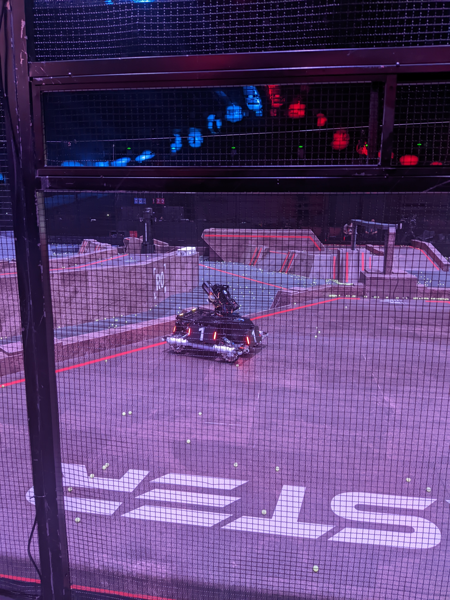

# XRobot

一套可在PC/MCU/模拟器运行的机器人控制系统，诞生于Robomaster比赛，但绝不局限于此。

## 开发规划

- [ ] 从主仓库移动所有模块至单独仓库

- [ ] 使用Repo管理模块

- [ ] 剥离Robomaster相关代码

- [ ] STM32F103硬件适配

- [ ] Linux平台程序部署

## 项目规划

- [ ] 上架现有模块

- [ ] 丰富机器人种类和功能

---

