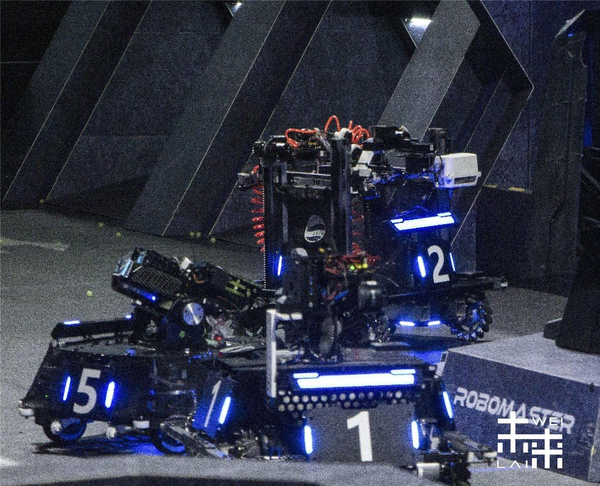
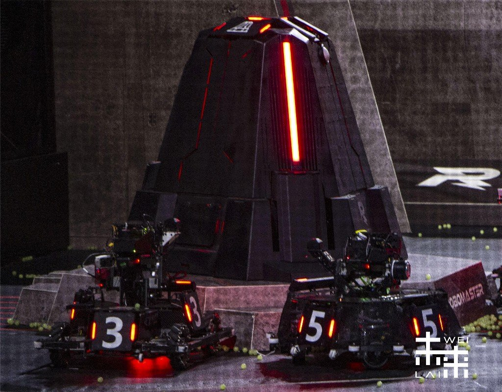
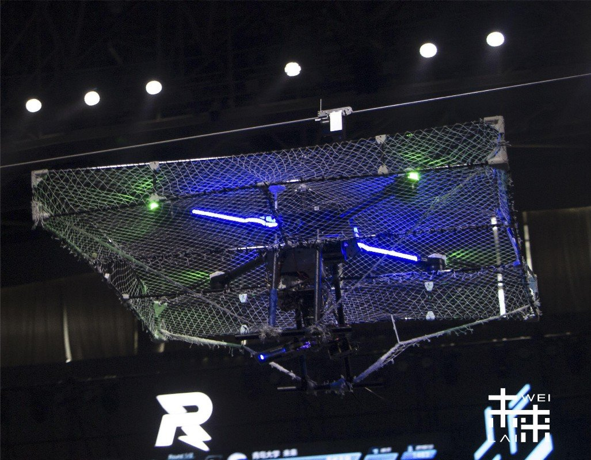
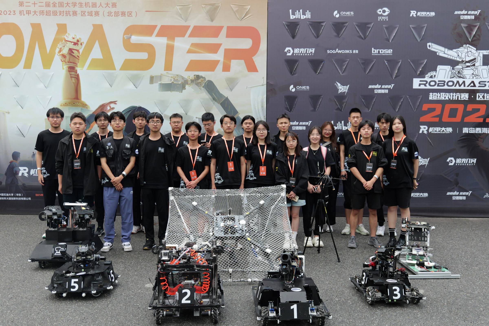

# XRobot

一套可在PC/MCU/模拟器运行的嵌入式软件框架，诞生于Robomaster比赛，但绝不局限于此。

## 开发规划

- [ ] 单个项目中robot与bsp绑定

## 项目规划

- [ ] 丰富机器人种类和功能
- [ ] 进一步完善文档，统一接口
- [ ] 教学开发板&配套网课

---

||||
|-|-|-|
|||

`以上机器人均使用XRobot驱动`
